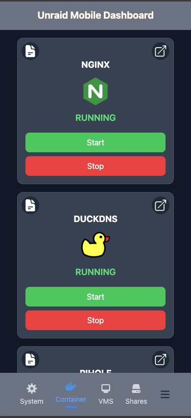
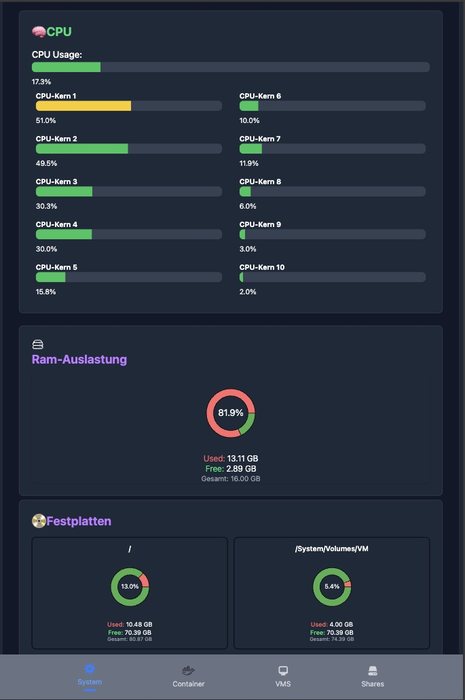

# 📱 Unraid Mobile Dashboard

> Ein responsives Web-Dashboard zur Überwachung und Verwaltung deines Unraid-Servers – speziell für mobile Geräte optimiert.

 <!-- ↠Hier ist dein GIF, z.B. ein animierter Ablauf -->

---

## ✨ Features

- 📊 **Live-Systemstatistiken**
  - CPU-Auslastung (gesamt & pro Kern)
  - RAM-Verbrauch
  - Festplattenbelegung

- 🐳 **Docker-Container-Verwaltung**
  - Statusanzeige (Running/Stopped)
  - Starten / Stoppen direkt aus dem Dashboard

- ⚡ **Echtzeitdaten**
  - Integration der Unraid GraphQL API mit `Apollo Client`
  - Eigene Schnittstelle mit Python + FastAPI

- 📱 **Mobile-first UI**
  - Perfekt nutzbar auf iPhone, Android & Tablets
  - Dunkles Farbschema & moderne Visualisierungen

---

## 🔜 Geplante Features

- 🖥️ **VM-Verwaltung (VMS)**
  - Übersicht, Start/Stop, Performance

- 📁 **Shares & Storage-Zugriff**
  - Anzeige & Status von SMB/NFS-Shares

---

## 🛠️ Tech Stack

### Frontend
- React (Vite)
- TailwindCSS
- Apollo Client (GraphQL)
- Zustand (State Management, optional)
- [Geplant] TypeScript

### Backend
- Python
- FastAPI
- Dockerized REST-API
- Zugriff auf System- und Containerdaten (z. B. über `psutil`, `docker-py`)
